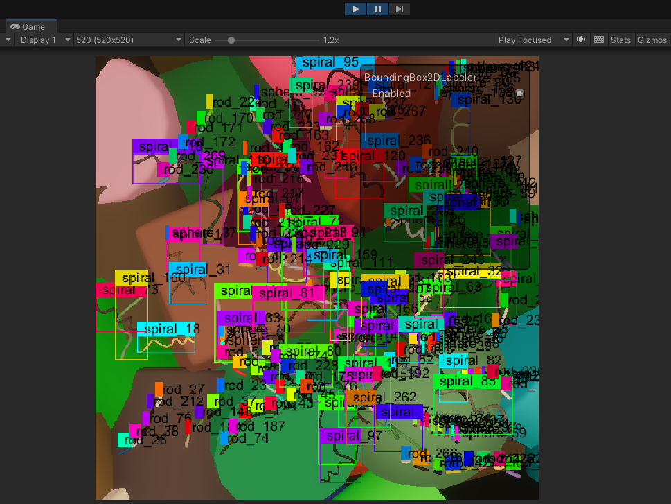

//Logo

# Bacteria Dataset Generator

Simulating realistic microbiology data is a challenge due to the need for specialized equipment such as microscopes, cameras, and bacterial cultures—as well as domain expertise in bacteriology. This project proposes a solution by generating synthetic datasets using a video game engine that simulates bacterial colonies.

The system creates synthetic images alongside automated annotations. Each bacterium's position is marked with a 2D bounding box, generating data compatible with modern object detection frameworks. The dataset's effectiveness is evaluated using the YOLO (You Only Look Once) object detection algorithm.

## Tutorials

## 1. Unity tutorial
How to run the project and generate the datasets
1. Git clone the project
2. Open Unity hub and select on add project from disk

3. Select the project inside of SynBactGen\BacteriaGeneratorUnity (the project cloned in the step 1). Use the Editor version 2021.3.18f1.

4. Open the project with the editor version selected before.

5. Once the project opens, click on file and open scene, select TecnicalNoteV1.unity. This will load all the configuration needed to the generation.

6. Go to the simulation scenario, you will see the randomizers configured. If you want to customize this configuration, you can read the documentation section of randomizers and their configurations. 

7. Click on pause and then play to see the generation of image step to step. click on the  Step button to see the next generated image. To generate all without pause, just click on play button without pause.

8. If you go to Project Settings, then perception, you can select the base path where the dataset wil be saved.

Special notes: If you have problems with this generation, you can review the perception tutorial where it is explained the configuration of HDRP, camera and light. https://docs.unity3d.com/Packages/com.unity.perception@1.0/manual/Tutorial/Phase1.html

## 2. Training with the dataset generated

prerequisited: Download a already generated dataset here (link), or generated a new dataset following the unity tutorial.

1. you will have the follow dataset structure.

* Sequence folders
    * Step0.camera.png
    * step0.frame_data.json

* anotation_definition.json
* metadata.json
* metric_definitions.json
* sensor_definitions.json

The files inside sequence folders and the anotation_definition.json is used to convert into YOLO format.

First, it is required to do a conversion of format, for this, you can use the file ConvertFormatToYOLO.ipynb.

To this step, please follow the instructions in the same jupyter notebook. JupyterNotebooks\ConvertFormatToYOLO.ipynb

