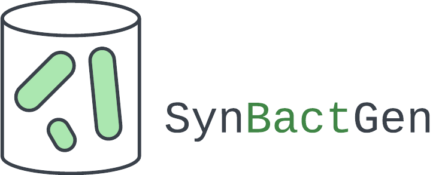
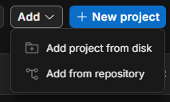
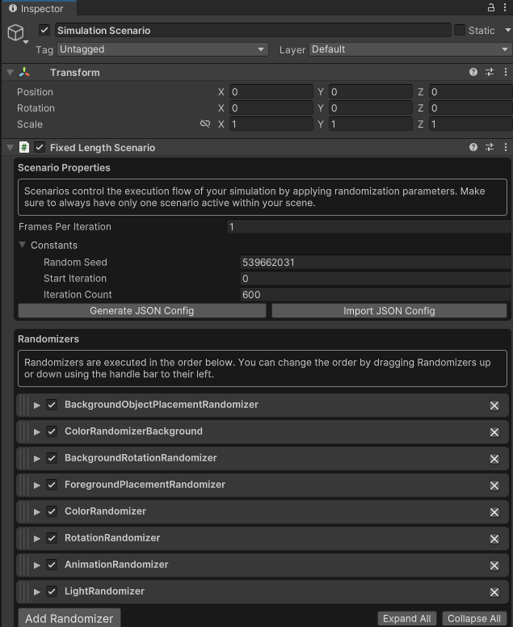
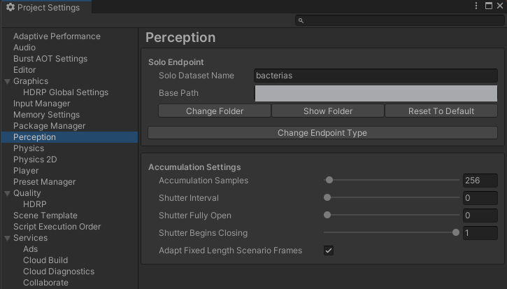

# Bacteria Dataset Generator


Simulating realistic microbiology data is a challenge due to the need for specialized equipment such as microscopes, cameras, and bacterial cultures—as well as domain expertise in bacteriology. This project proposes a solution by generating synthetic datasets using a video game engine that simulates bacterial colonies.

The system creates synthetic images alongside automated annotations. Each bacterium's position is marked with a 2D bounding box, generating data compatible with modern object detection frameworks. The dataset's effectiveness is evaluated using the YOLO (You Only Look Once) object detection algorithm.


## Workflow Overview

The project supports multiple workflows depending on your goals. **Choose your path below:**

### Complete Workflow (Full Training Pipeline)
Use this if you want to generate synthetic data, convert it, and train a custom model:

```
1. Unity Dataset Generation (Section 1)
   └─ Use BacteriaGeneratorUnity to generate synthetic images and annotations
   └─ Output: Custom format dataset with JSON annotations

2. Format Conversion (Section 2)
   └─ Run ConvertFormatToYOLO.ipynb
   └─ Output: YOLO-compatible dataset with train/valid splits

3. Model Training (Section 3)
   └─ Run YOLOV26_Proof_Of_Concept.ipynb training section
   └─ Output: Trained model, validation metrics, inference results
```

### Quick Inference Workflow (Using Pre-trained Model)
Use this if you want to skip dataset generation and training, and directly run inference on your own bacterial images:

```
1. Skip to Section 3 (Model Training and Inference)
   └─ Go directly to "Quick Start: Using the Pre-trained Model"

2. Load Pre-trained Model
   └─ Load yolo26-bacteria-det-synbactgen-v1.pt from Models/

3. Direct Inference on Real Images
   └─ Run Inference section in YOLOV26_Proof_Of_Concept.ipynb
   └─ Output: Annotated predictions on your bacterial images
```


## 1. Unity Dataset Generation

### Prerequisites

**System Requirements:**
- **OS**: Windows 10/11, macOS, or Linux
- **Unity Editor**: Version 2021.3.18f1
- **RAM**: 8GB minimum (16GB+ recommended)
- **CPU**: Multi-core processor (e.g., AMD Ryzen 7 5800X or equivalent)
- **Storage**: 5-10GB for Unity project and generated datasets
  - Example: 600 images (520x520 resolution) with annotations = ~185 MB

**Installation Steps:**
1. **Clone the Repository**
   ```bash
   git clone https://github.com/danivmr/SynBactGen.git
   cd Bacteria-dataset-generator
   ```

2. **Download Unity**
   - Download Unity Editor version 2021.3.18f1 from [Unity Download Archive](https://unity3d.com/download/download_unity)

### Tutorial: Running the Project and Generating Datasets

1. Clone the repository using Git
2. Open Unity Hub and select "Add project from disk"



3. Navigate to the `BacteriaGeneratorUnity` folder from the cloned repository and select it. Use Unity Editor version 2021.3.18f1.

4. Open the project with the selected Editor version.

5. Once the project opens, go to File > Open Scene and select `TechnicalNoteV1.unity`. This will load the configuration required for dataset generation.

6. Navigate to the simulation scenario to view the configured randomizers. Refer to the Randomizers and Configurations section below for customization details. 



7. Click Pause, then Play to observe the image generation step-by-step. Click the Step button to advance to the next generated image. To generate all images continuously, click Play without pausing.


8. Navigate to Project Settings > Perception to specify the base path where the dataset will be saved.



**Note:** If you encounter issues during generation, refer to the [Unity Perception Tutorial](https://docs.unity3d.com/Packages/com.unity.perception@1.0/manual/Tutorial/Phase1.html) for guidance on configuring HDRP, camera, and lighting.


## 2. Dataset Format and Conversion

### Prerequisites

- **Python**: 3.8 or higher
- **RAM**: 4GB minimum for typical datasets
- **Generated Dataset**: A dataset from Section 1 (Unity Dataset Generation) or use the provided example dataset

**Installation Steps:**
1. **Set Up Python Environment**
   ```bash
   python -m venv venv
   # On Windows:
   venv\Scripts\activate
   # On macOS/Linux:
   source venv/bin/activate
   ```

2. **Install Python Dependencies**
   ```bash
   pip install notebook pillow numpy pandas
   ```

### Tutorial: Converting to YOLO Format

#### Input Dataset Structure (Generated from Unity)

The generated dataset from Unity has the following structure:

```
dataset/
├── sequence_0/
│   ├── Step0.camera.png
│   ├── step0.frame_data.json
│   └── ...
├── sequence_1/
│   └── ...
├── annotation_definitions.json
├── metadata.json
├── metric_definitions.json
└── sensor_definitions.json
```

Each sequence contains:
- **Step*.camera.png** - RGB image of bacterial colonies
- **step*.frame_data.json** - Frame metadata and bounding box annotations for detected bacteria

#### Conversion Steps

Follow the instructions in [ConvertFormatToYOLO.ipynb](JupyterNotebooks/ConvertFormatToYOLO.ipynb) to:

1. **Extract class labels** from annotation definitions
2. **Split data** into training and validation sets
3. **Convert bounding box coordinates** from custom format to YOLO normalized format (center coordinates in 0-1 range)
4. **Generate output structure** with organized train/valid splits containing images and labels
5. **Archive the dataset** as a compressed file

#### Output Dataset Structure (YOLO Format)

The notebook will produce:
```
converted_dataset/
├── train/
│   ├── images/
│   └── labels/
├── valid/
│   ├── images/
│   └── labels/
├── classes.txt
└── data.yaml
```

## 3. Model Training and Inference

### Prerequisites

- **GPU**: NVIDIA GPU recommended (or use Google Colab's free GPU)
- **Internet**: Required for Colab access
- **Python**: 3.8 or higher
- **YOLO Dataset**: A YOLO-formatted dataset created using Section 2

**Installation Steps:**
1. **Set Up Python Environment** (if running locally)
   ```bash
   python -m venv venv
   # On Windows:
   venv\Scripts\activate
   # On macOS/Linux:
   source venv/bin/activate
   ```

2. **Install Dependencies** (if running locally)
   ```bash
   pip install notebook ultralytics torch
   ```

### Tutorial: Model Training and Inference

#### Using the Training Notebook (Google Colab - Recommended)

The training notebook is optimized for **Google Colab** and has been tested in this environment. Follow the instructions in [YOLOV26_Proof_Of_Concept.ipynb](JupyterNotebooks/YOLOV26_Proof_Of_Concept.ipynb). This notebook provides a complete pipeline:

1. **Data Preparation** - Extract the training dataset and install the YOLOv8 detection library (ultralytics)

2. **Model Training** - Train a YOLO26n model on your bacteria dataset for 100 epochs with optimized image size (520px)

3. **Model Validation** - Evaluate the trained model on the test dataset to assess detection accuracy and performance metrics

4. **Inference and Visualization** - Execute inference on test images to generate annotated predictions with detected bacterial objects and confidence scores

5. **Results Archival** - Compress and backup experiment outputs for reproducibility

**Setup Instructions:**
- Open the notebook using the "Open in Colab" button at the top of [YOLOV26_Proof_Of_Concept.ipynb](JupyterNotebooks/YOLOV26_Proof_Of_Concept.ipynb)
- Colab provides free GPU acceleration (NVIDIA GPUs), eliminating setup complexity

#### Quick Start: Using the Pre-trained Model

If you want to skip training and use the already trained model for inference on real bacterial images:

1. Open [YOLOV26_Proof_Of_Concept.ipynb](JupyterNotebooks/YOLOV26_Proof_Of_Concept.ipynb) in Google Colab
2. Skip to the **Inference and Results Visualization** section (Section 3)
3. Load the pre-trained model from `Models/yolo26-bacteria-det-synbactgen-v1.pt`
4. Provide your real bacterial images in the `source` parameter
5. The notebook will generate annotated predictions with detected bacterial objects and confidence scores

This approach is ideal for:
- Testing the model on new, unseen bacterial images
- Quick evaluation without retraining
- Integration into analysis pipelines
